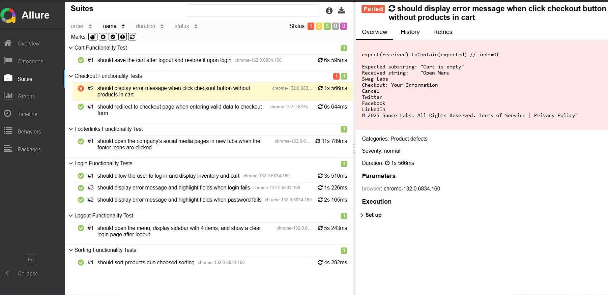

# Webdriverio Saucedemo Test

## Overview

This project is a test automation suite built using [WebdriverIO](https://webdriver.io/), aimed at ensuring the functionality and reliability of [web-site](https://www.saucedemo.com/). It includes a series of automated tests that cover essential user interactions, including login, item selection, and checkout processes.

## Test-case

You can find the test-case details [here](https://testluxequality.sharepoint.com/:x:/s/Mentors/EdKKAdQM7uRGgdG-zFoeXdEBYSo3Gg_YRlAX6WaC1imLuQ?rtime=1buvryJG3Ug).

## Prerequisites

Before you begin, ensure you have met the following requirements:

- **Node.js**: Install [Node.js](https://nodejs.org/) (version 14 or higher).
- **WebdriverIO** package and its dependencies (installable via npm).
- A modern web browser (e.g., Google Chrome) installed on your system for running the tests.

## Installation

To set up the project, follow these steps:

1. **Clone the Repository**:

   ```bash
   git clone https://github.com/gadiim/webdriverio_saucedemo_test.git
   ```
2. **Navigate into the directory**:
   ```bash
   cd webdriverio_saucedemo_test
   ```
3. **Install Dependencies**:
   ```bash
   npm install
   ```

## Allure Reporting

Allure is used for generating detailed test reports.

  

## Scripts

### Running Tests

* To open the WebdriverIO Test Runner:
   ```bush  
   npm run test
   ```
* To run tests for specific test files:
   ```bush 
   npm run test:login
   ```
   ```bush
   npm run test:logout
   ```
   ```bush 
   npm run test:cart
   ```
   ```bush
   npm run test:sorting
   ```
   ```bush 
   npm run test:footer
   ```
   ```bush 
   npm run test:checkout
   ```

### Generate Allure Reports

* To generate the Allure report from the test results:
   ```bush 
   npm run allure:generate
   ```
* To open the Allure report in the browser.
   ```bush 
   npm run allure:open
   ```
* To clears the reports directory.
   ```bush 
   npm run allure:clean
   ```

## Test Structure

The tests are organized in the following structure:
   ```sql
webdriverio_saucedemo_test/
├── .gitignore
├── README.md
├── package.json
├── tsconfig.json
├── wdio.conf.js
├── test/
│   ├── specs/
│   │   ├── login_test.js
│   │   ├── logout_test.js
│   │   ├── cart_test.js
│   │   ├── sorting_test.js
│   │   ├── footer_test.js
│   │   ├── checkout_test.js
│   ├── pageobjects/
│   │   ├── loginpage.js
│   │   ├── inventorypage.js
│   │   ├── cartpage.js
│   │   ├── checkoutpage.js
│   └── data/
│   │   ├── fake_data_generator.js
│   │   └── data.js
   ```
* `wdio.conf.js`: The WebdriverIO configuration file that contains test settings, browser capabilities, and environment details.
* `test/specs/`: Contains the end-to-end test files.
* `test/pageobjects/`: Contains the page object files that define the structure and elements of the webpages to interact with.
* `test/data/`: Contains any test data files, such as user information for login.

## License

This project is licensed under the MIT License. You are free to use, modify, and distribute this project. See the [LICENSE](./LICENSE.txt) file for more details.